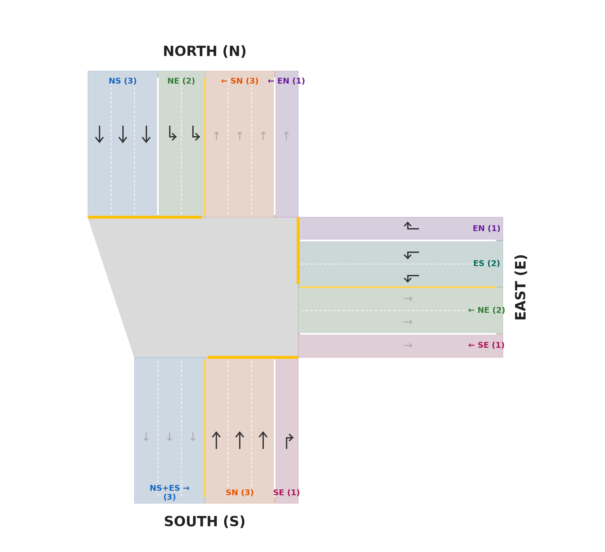
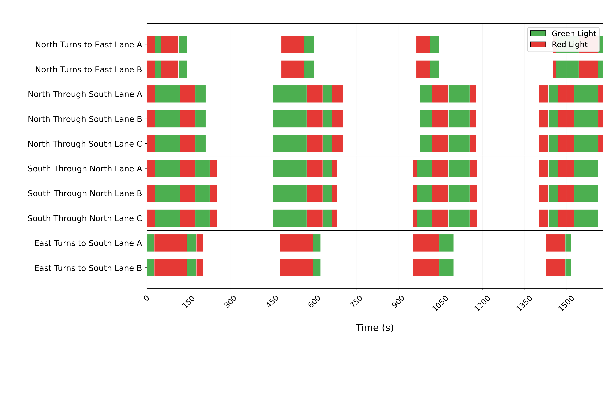
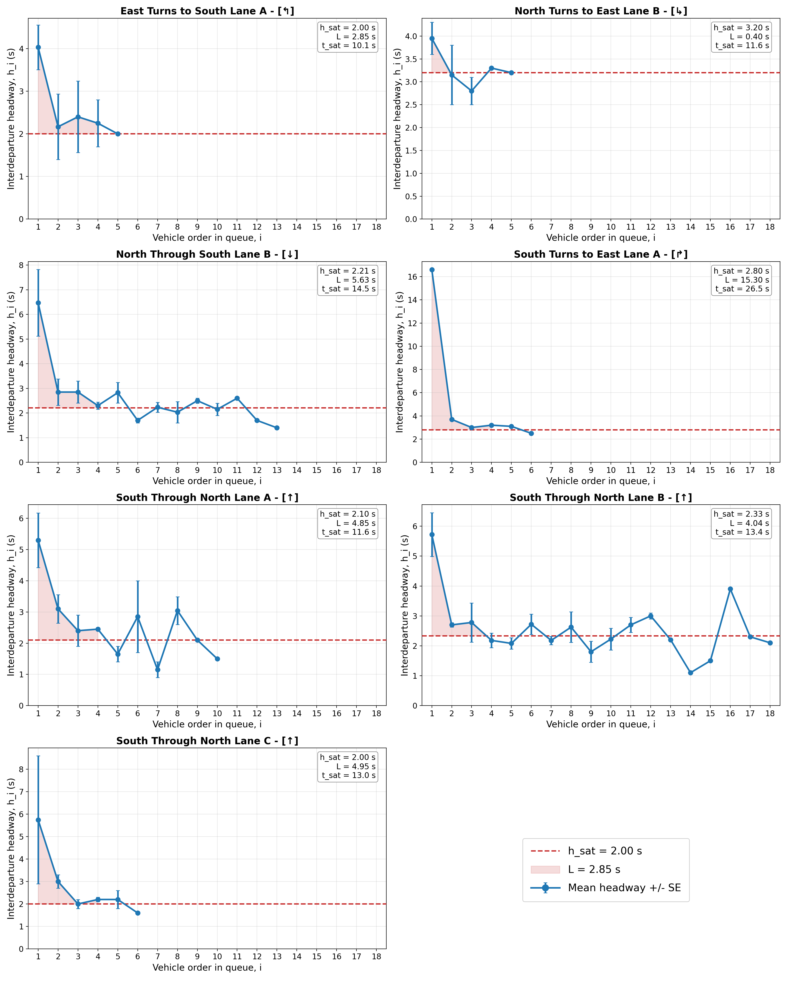
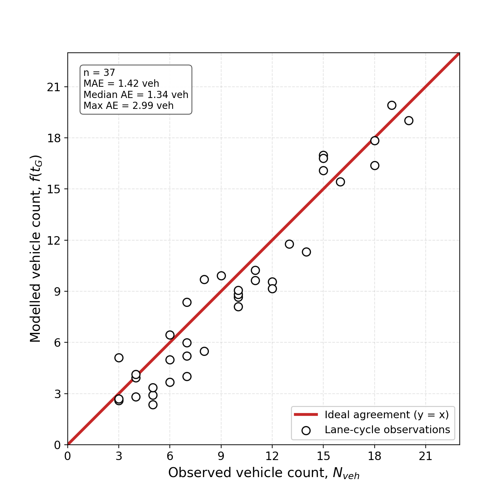

# Traffic Analysis from UAV Trajectory Data in Songdo, South Korea

This repository showcases thesis work on intersection-level traffic analysis
using UAV-obtained vehicle trajectory data from Songdo, South Korea.

The project focuses on extracting traffic engineering measures from trajectory
data, including movement classification, lane-level space-time diagrams, signal
phase inference, interdeparture headway modelling, saturation flow estimation,
and cycle-level model validation.

## Study Scope

- **Study area:** Songdo, South Korea
- **Main case study:** Q intersection
- **Additional intersections:** M and R intersections
- **Data source:** UAV vehicle trajectory data
- **Main analysis level:** lane-level and signal-cycle-level traffic behavior

## Methodology Overview

The analysis workflow is implemented in Python and follows these main steps:

1. Load UAV trajectory data and intersection geometry.
2. Assign vehicles to road sections, movements, and lanes.
3. Generate space-time diagrams for visual validation of vehicle motion.
4. Infer signal phases from observed stopping and discharge behavior.
5. Detect vehicle arrivals and stop-line departures.
6. Compute interdeparture headways by lane and queue position.
7. Estimate saturation headway, saturation flow rate, and startup lost time.
8. Validate cycle-level discharge predictions against observed vehicle counts.

## Selected Results

### Q Intersection Layout



### Protected Signal Timing



### Headway vs Vehicle Order in Queue



### Model Validation



## Repository Contents

```text
assets/
  figures/
    q_intersection_layout.png
    protected_signal_timing.png
    headway_vehicle_order.png
    model_validation_pairwise.png
README.md
```

## Notes

This repository is intended as a public showcase of the thesis workflow and
selected outputs. Raw trajectory files, full generated output folders, and the
full thesis PDF are intentionally not included.

## Author

Alexandros Vryonides
