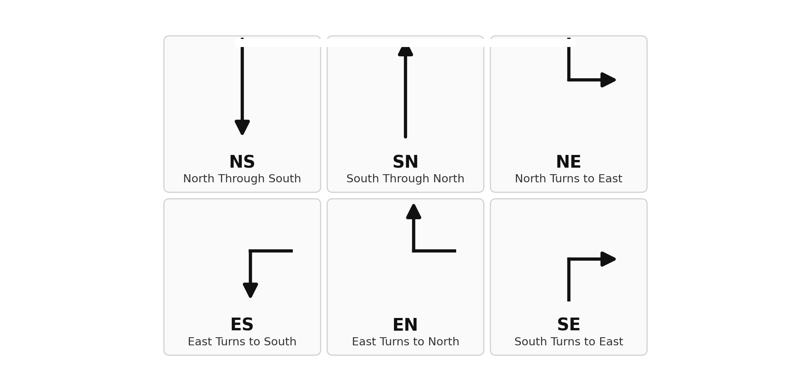
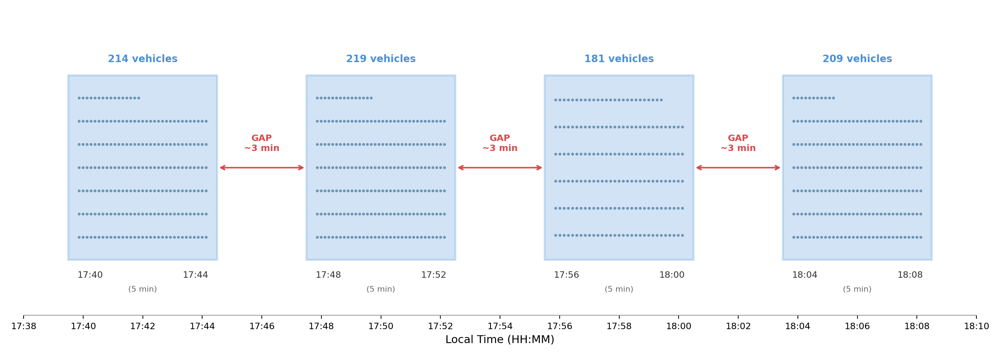
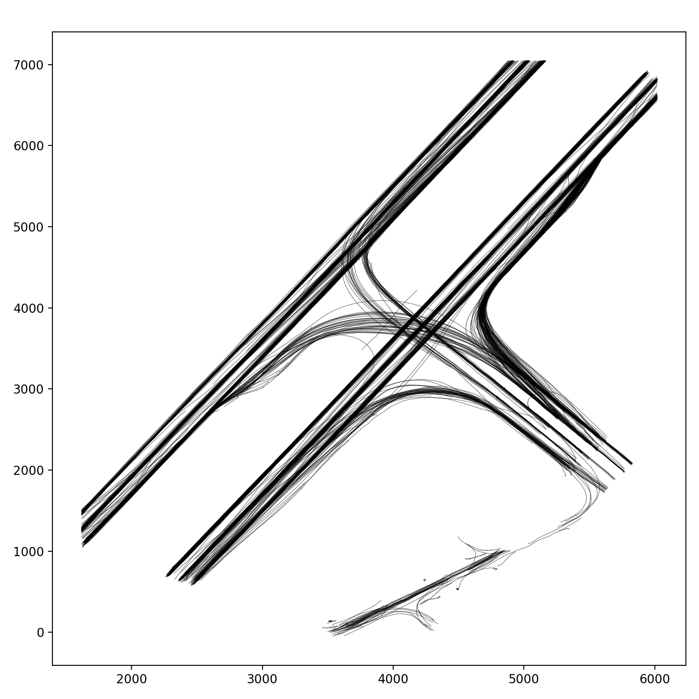
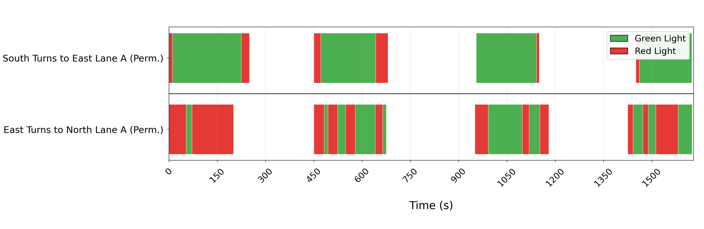
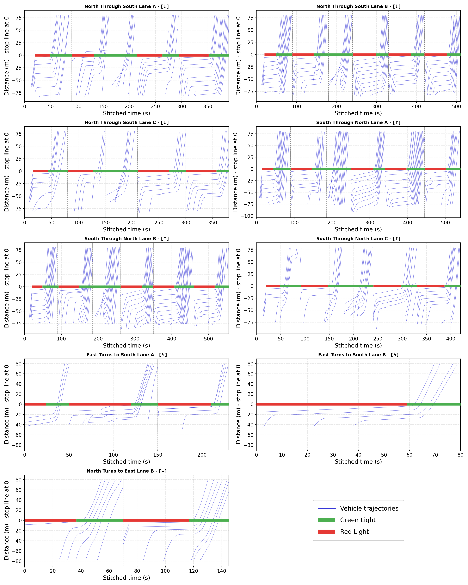
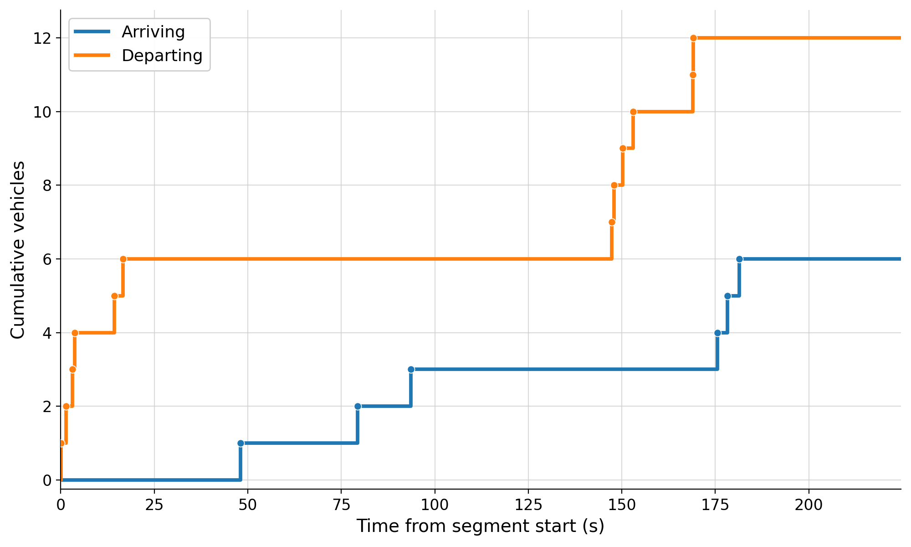

# UAV-Based Traffic Analysis at Songdo Intersections

This repository showcases thesis work on traffic analysis from UAV-obtained
vehicle trajectory data in Songdo, South Korea.

The project develops a Python workflow for extracting intersection performance
measures from vehicle trajectories, with emphasis on the Q intersection as the
main case study and additional analysis for the M and R intersections.

Raw UAV trajectory files and full generated output folders are intentionally not
included in this public repository.

## Contents

- [Project Motivation](#project-motivation)
- [Study Area](#study-area)
- [Analysis Workflow](#analysis-workflow)
- [Selected Outputs](#selected-outputs)
- [Reusable Scripts](#reusable-scripts)
- [Result Tables](#result-tables)
- [Thesis PDF](#thesis-pdf)
- [Repository Structure](#repository-structure)
- [Notes on Data Availability](#notes-on-data-availability)

## Project Motivation

Traditional traffic data sources such as loop detectors, static roadside
cameras, GPS traces, and Bluetooth sensors often provide incomplete spatial
coverage or limited vehicle-level detail. UAV trajectory data provides a richer
view of intersection behavior because individual vehicle paths can be followed
through the intersection area.

This work uses that vehicle-level trajectory information to study:

- lane-level movement behavior,
- queue discharge after signal changes,
- inferred traffic signal phases,
- interdeparture headways,
- saturation flow behavior,
- cycle-level agreement between observed and modelled discharge.

## Study Area

The analysis focuses on three intersections in Songdo, South Korea:

| Code | Role in thesis | Notes |
| --- | --- | --- |
| Q | Main case study | T-junction; most complete analysis and final model validation |
| M | Additional intersection | Larger non-T-junction intersection used for extension testing |
| R | Additional intersection | Larger non-T-junction intersection used for extension testing |

The public showcase focuses on Q because it is the clearest and most complete
case study in the thesis workflow.

## Analysis Workflow

The implementation follows a trajectory-to-traffic-measures pipeline:

1. **Trajectory loading and preprocessing**
   - Load UAV vehicle trajectory records.
   - Parse timestamps into elapsed seconds.
   - Keep relevant spatial and vehicle-level columns.

2. **Geometry and movement assignment**
   - Use intersection geometry and road-section rules.
   - Assign vehicles to origin-destination movement codes.
   - Separate movements by lane where lane information is available or inferred.

3. **Space-time diagram generation**
   - Plot vehicle trajectories per movement and lane.
   - Overlay inferred red and green intervals for visual checking.
   - Use zoomed diagrams to inspect specific signal cycles.

4. **Signal timing inference**
   - Infer green and red behavior from observed stopping and discharge patterns.
   - Separate protected and permissive movements where required.
   - Export signal timing diagrams and phase summaries.

5. **Headway and startup modelling**
   - Detect stop-line departures during green intervals.
   - Compute interdeparture headways by queue order.
   - Estimate saturation headway, saturation rate, and startup behavior per lane.

6. **Cycle-level validation**
   - Count observed vehicles departing during each green period.
   - Compare observed counts with modelled counts.
   - Summarize error using mean absolute error and related metrics.

More implementation detail is available in [docs/methodology.md](docs/methodology.md).

## Selected Outputs

### Q Intersection Layout


### Turning Movements



### Recording Timeline



### Route Map



### Protected Signal Timing


### Permissive Signal Timing



### Composite Space-Time Diagram



### Cumulative Arrival and Departure Example



### Headway vs Vehicle Order in Queue


### Model Validation


## Reusable Scripts

The reusable analysis code is provided in [analysis_scripts/](analysis_scripts/).
The scripts are organized by intersection:

| Folder | Purpose |
| --- | --- |
| `analysis_scripts/songdo_q/` | Q intersection pipeline and final thesis analysis workflow |
| `analysis_scripts/songdo_m/` | M intersection adaptation |
| `analysis_scripts/songdo_r/` | R intersection adaptation |

The scripts can be adapted to another intersection by modifying geometry files,
movement rules, lane rules, and protected/permissive signal definitions.

Install dependencies with:

```bash
pip install -r requirements.txt
```

Example Q run:

```bash
cd analysis_scripts
python -m songdo_q --traj /path/to/trajectory_Q.csv --seg /path/to/Q.csv --out /path/to/outputs_Q
```

See [analysis_scripts/README.md](analysis_scripts/README.md) for more detail.

## Result Tables

Selected processed tables are included in [results/](results/):

| File | Description |
| --- | --- |
| `lane_saturation_model_table.csv` | Lane-level saturation headway, time until saturation, and saturation rate |
| `lane_saturation_model_summary.csv` | Protected movement summary grouped overall, through movements, and turning movements |
| `traffic_light_capped_median_validation_table.csv` | Cycle-level observed vs modelled discharge comparison |
| `traffic_light_validation_summary.csv` | Validation error summary including MAE |

The tables contain processed thesis results only, not raw UAV trajectory data.

## Thesis PDF

The thesis PDF is included in [thesis/thesis.pdf](thesis/thesis.pdf).

## Repository Structure

```text
analysis_scripts/
  songdo_q/
  songdo_m/
  songdo_r/
  README.md
assets/
  figures/
    q_intersection_layout.png
    turning_movements.png
    recording_timeline.png
    route_map.png
    protected_signal_timing.png
    permissive_signal_timing.png
    composite_space_time_all.png
    cumulative_es_1740_1744.png
    headway_vehicle_order.png
    model_validation_pairwise.png
docs/
  methodology.md
  outputs.md
results/
  lane_saturation_model_table.csv
  lane_saturation_model_summary.csv
  traffic_light_capped_median_validation_table.csv
  traffic_light_validation_summary.csv
thesis/
  thesis.pdf
README.md
requirements.txt
```

## Notes on Data Availability

This repository is a public showcase, not the complete working research
directory. The following are intentionally excluded:

- raw UAV trajectory CSV files,
- generated full output directories,
- videos,
- private draft material.

## Author

Alexandros Vryonides
